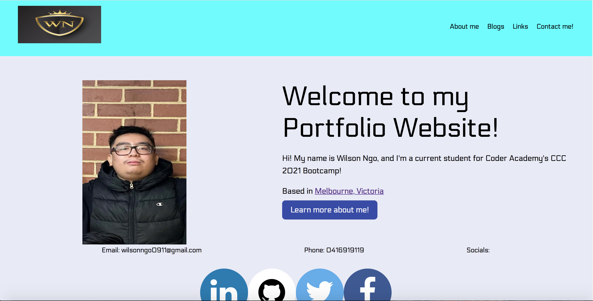
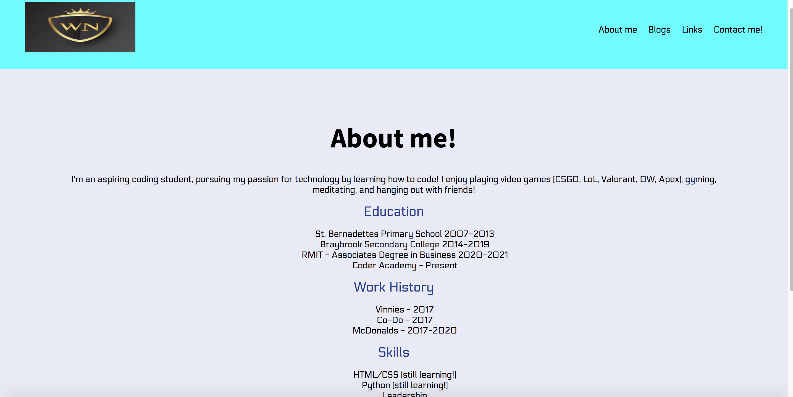
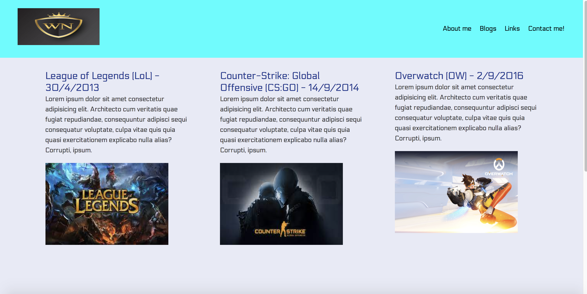
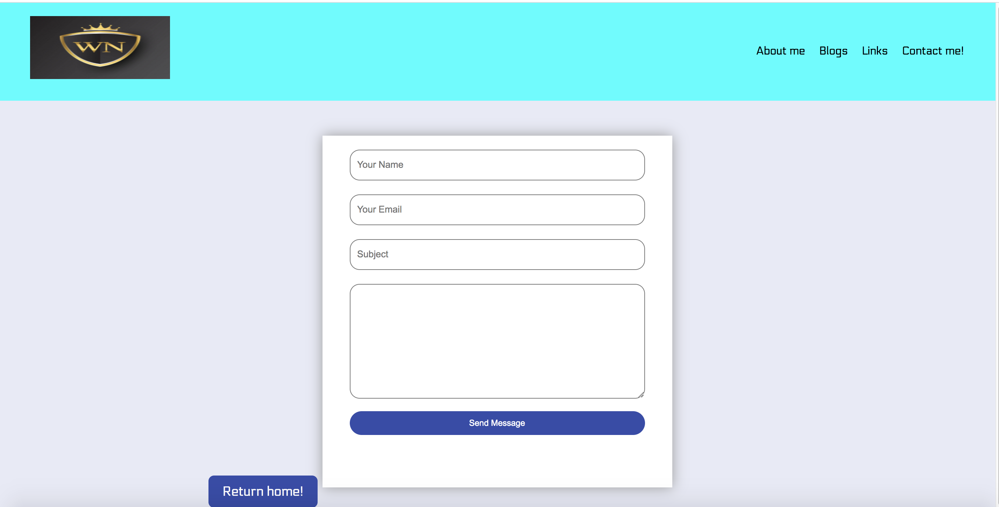
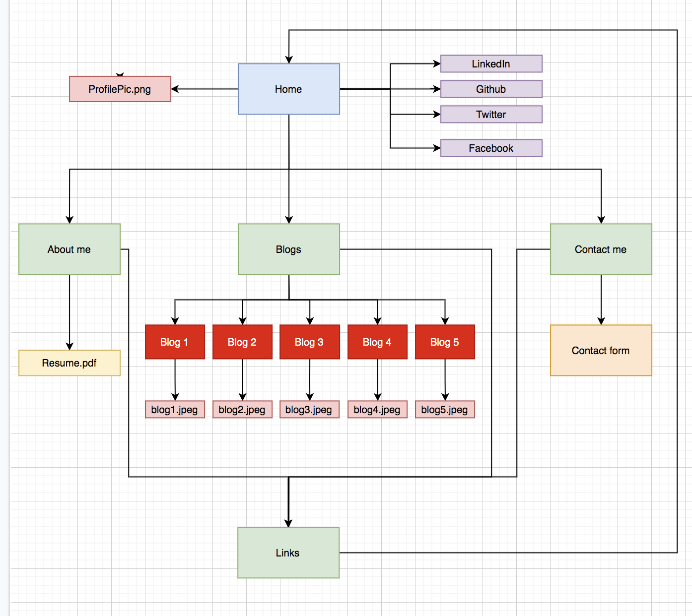

#
Wilson Ngo AT2 - Portfolio

#
**Links:**

###
* Link to live portfolio site can be accessed [here](https://wilsonlengo.github.io/src/index.html#)

###
* Link to github repository can be accessed [here](https://github.com/wilsonlengo/wilsonlengo.github.io)

#
**Portfolio:**

##
**Purpose:**
* The purpose of my portfolio website is to showcase to potential employers my skill sets, work history, education history + certifications, and my biography

* It also serves as an easy access point for my information for potential emplopers

##
**Functionality:**
* Easy access point for information about myself
* Download Resume
* Point of contact (contact form)

##
**Screenshots:**

##
Sitemap

##
**Target Audience**
* Potential employers
* Work colleagues

##
**Tech stack**
* HTML
* CSS
* Source control: Github
* Deployment platform: Github Pages
* Coding: VSC

